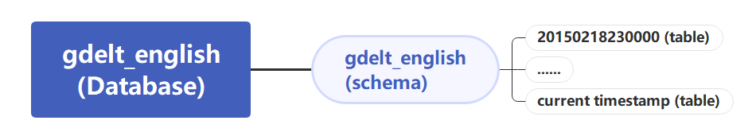

# Gdelt English Database Instructions

This is the README file for gdelt Postgres database. Data range from 2015/02/17 23:00:00 till now.

## task

* download zip from [Master CSV Data File List -English](http://data.gdeltproject.org/gdeltv2/masterfilelist.txt):  

  https://blog.gdeltproject.org/gdelt-2-0-our-global-world-in-realtime/

* clean the data 

* insert into Postgres database

* update database every 15 minutes from [Last 15 Minutes CSV Data File List -English](http://data.gdeltproject.org/gdeltv2/lastupdate.txt)

## Database Framework

## file storing instruction

* The codes and logging files are stored in file `"/Users/macglobalai/Desktop/gdelt database"`.
* The original zip for 2022/01 - 2024/05 is stored in hard drive `"/T5EVO/postgres_data/zip"`.
* The raw csv data is stored in hard drive `"/T5EVO/postgres_data"` where missing time name are stored as null file is in the `"/T5EVO/postgres_data/missing_zip"`.
* The cleaned csv data with sub columns added is stored in hard drive `"/T5EVO/postgres_data"` where missing time name are stored as null file is in the `"/T5EVO/postgres_data/missing_zip_empty_csv"`.
* The database data is stored in hard drive `"/T5EVO/postgres/base"` which is moved out from default postgresql data path. 

## log txt instruction

* The error messages and downloading time are stored in `"/Users/macglobalai/Desktop/gdelt database/download_zip_log/"`
* The missing timestamp file names are stored in `"/Users/macglobalai/Desktop/gdelt database/missing_timestamp_log/"`

* The csv cleaning time are stored in `"/Users/macglobalai/Desktop/gdelt database/csv_clean_log/"`

* The cleaned csv insertion time are stored in `"/Users/macglobalai/Desktop/gdelt database/clean_insertion_log/"`

  (P.S. During this process, the tables for a year is stored in its own schema first and then moved to the main schema to ensure the correctness. Thus, the time for moving the tables are stored in `"/Users/macglobalai/Desktop/gdelt database/schema_move_log/"`)

  

## gdelt_sql_download.ipynb:

This is the codes for the zip downloading and processing to get raw csv. 

## csv_modify.ipynb

There are several parts in this file, including csv cleaning, insertion, null csv generation and schema operations.

* csv cleaning: 

  parse the raw csv to get all sub columns according to the codebook. And fill in all null cells by 'None'.

* insertion: 

  There are mainly two methods used to insert. 

  * After downloading zip, do the insertion immediately by using  `insert_into_database(final_all, database_url, names[0])`. The logic is to write into the database row by row, which led to huge data insertion time from 2017/02. 
  * After downloading the zip for a whole year, use the stored csv to insert by using copy method. 

* null csv generation:

  According to `"/Users/macglobalai/Desktop/gdelt database/missing_timestamp_log/"`, null files are generated with all columns but no data to ensure the consistent timestamps throughout years.

* schema operations:

  Since the tables are first inserted separately and concatenated afterwards, it requires the move operation among schemas.

  There are also other parts of code for small functions used such as checking the missing csv that is downloaded but not inserted, and align the table names in the same format etc.

  

## auto15_gdelt.py:

This is the code file for automatically database update.

* To run it use terminal:
  1. `chmod +x /Users/macglobalai/Desktop/Gdelt\ Database/auto15_gdelt.py`
  2. open backstage running: `crontab -e`
  3. add to schedule: `*/15 * * * * /anaconda3/bin/python3.7 /Users/macglobalai/Desktop/Gdelt\ Database/auto15_gdelt.py`
  4. save and exit

* To terminate: 

  `pkill -f auto15_gdelt.py`